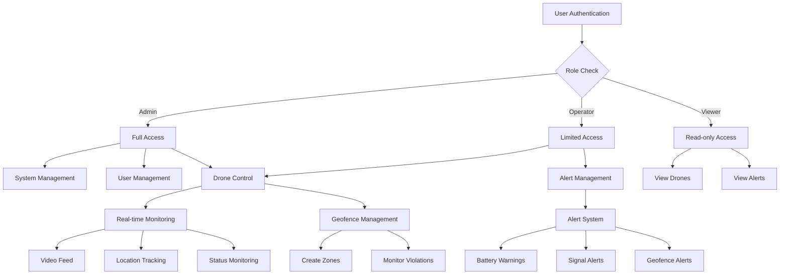
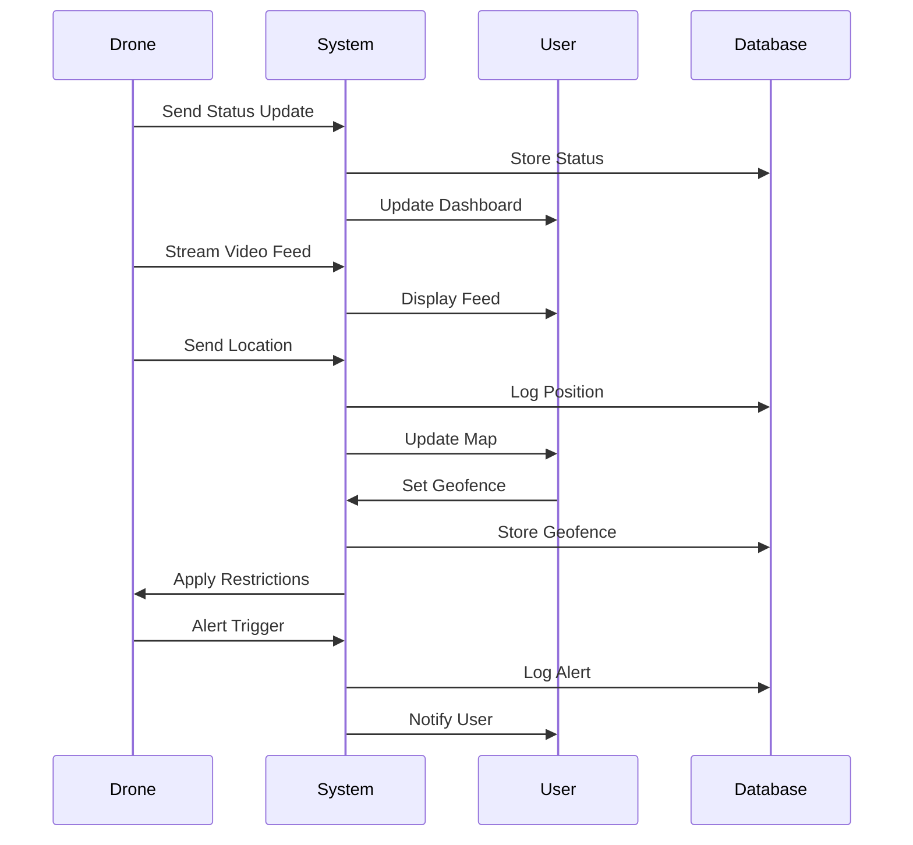

# UDMSystem


A sophisticated real-time UAV (Unmanned Aerial Vehicle) drone monitoring and control system developed by the OdaySec team for internal use. This system provides comprehensive surveillance, tracking, and management capabilities for multiple drone units.

## 🚀 Features

### 🎮 Real-time Monitoring
- Live video feeds from multiple drones
- Real-time position tracking on interactive map
- Battery level and signal strength monitoring
- Altitude and speed tracking
- Status indicators and warnings

### 🗺️ Geofencing
- Create and manage restricted areas
- Define operational zones
- Custom boundary creation
- Real-time violation alerts
- Color-coded zone visualization

### ⚠️ Alert System
- Battery level warnings
- Signal loss notifications
- Geofence violation alerts
- Real-time status updates
- Alert acknowledgment system

### 📊 Activity Logging
- Comprehensive flight logs
- System events tracking
- User action history
- Timestamp-based logging
- Searchable log entries

### 👥 User Management
- Role-based access control
- Multiple user roles (Admin, Operator, Viewer)
- User activity tracking
- Account management
- Secure authentication

### ⚙️ System Settings
- Notification preferences
- Map display settings
- Security configurations
- Data retention policies
- System backup options

## 🛠️ Technical Stack

- **Frontend**: React 18.3.1
- **Routing**: React Router 6.22.3
- **Mapping**: Leaflet with React-Leaflet
- **Styling**: Tailwind CSS
- **Icons**: Lucide React
- **Type Safety**: TypeScript
- **Build Tool**: Vite

## 🔒 Security Features

- Secure authentication system
- Role-based access control
- Session management
- Activity monitoring
- Geofence restrictions

## 🎯 Use Cases

1. **Surveillance Operations**
   - Real-time area monitoring
   - Restricted zone enforcement
   - Event tracking and logging

2. **Fleet Management**
   - Multiple drone tracking
   - Battery and maintenance monitoring
   - Operational status tracking

3. **Security Monitoring**
   - Restricted area surveillance
   - Violation detection
   - Incident logging

4. **Data Collection**
   - Flight path recording
   - Activity logging
   - Performance metrics
  
## 🔄 System Flow



## 🔄 Data Flow



## 🔧 Installation

```bash
# Clone the repository
git clone https://github.com/zdgdev/zdg-monitor.git

# Navigate to project directory
cd zdg-monitor

# Install dependencies
npm install

# Start development server
npm run dev
```

## 👥 User Roles

1. **Administrator**
   - Full system access
   - User management
   - System configuration
   - Geofence management

2. **Operator**
   - Drone control
   - Alert management
   - Activity monitoring
   - Report generation

3. **Viewer**
   - Read-only access
   - Live feed viewing
   - Alert viewing
   - Log access

## ⚙️ Configuration

The system can be configured through the settings panel for:

- Notification thresholds
- Map display options
- Security parameters
- Data retention policies
- Backup schedules

## 🔐 Authentication

Default demo credentials:
- Admin: `admin / password`
- Operator: `operator / password`
- Viewer: `viewer / password`

## 🛡️ Security Notice

This repository is private and contains sensitive information. Do not share access or distribute code without proper authorization.

## 👨‍💻 Development Team

Developed by [OdaySec](https://github.com/odaysec/)

## ⚠️ Important Notes

- For internal use only
- Requires proper authorization
- Contains sensitive information
- Regular updates required
- Maintain security protocols

## 📄 License

Private - All rights reserved. Unauthorized copying or distribution is strictly prohibited.

---

© 2024 OdaySec Team. All Rights Reserved.
